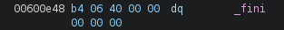
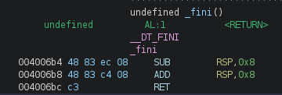
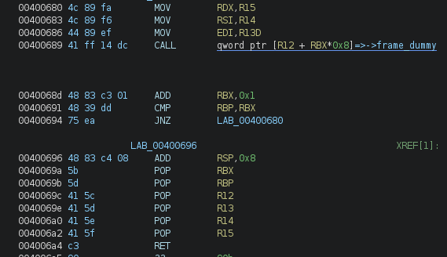

# ret2csu

### Challenge:

##### Link: [(https://ropemporium.com/challenge/ret2csu.html)]((https://ropemporium.com/challenge/ret2csu.html))
##### Files: [ret2csu](ret2csu)
##### Solve Script: [solve.py](solve.py) 

### Solution:

The goal of this challenge was to call the ret2win() function in the provided library with the arguments ```ret2win(0xdeadbeefdeadbeef, 0xcafebabecafebabe, 0xd00df00dd00df00d)``` however, we didn't have any apparent gadgets to populate the RDX register (aka the third argument).

To solve this challenge we needed to be familiar with the ```ret2csu``` technique, [here](https://ir0nstone.gitbook.io/notes/types/stack/ret2csu) you can find basically all you need about the subject.

Thanks to our new knowledge we can find 2 essential gadgets:
```asm
    pop rbx; pop rbp; pop r12; pop r13; pop r14; pop r15; ret;
    mov rdx, r15; mov rsi, r14; mov edi, r13d; call qword ptr [r12 + rbx*0x8]
```

This basically gives us full control on the relevant registers, we can also call an address of our choice thanks to the ```call qword ptr [r12 + rbx*0x8]```, however we need a pointer to said address, as shown by the ```qword ptr [r12 + rbx*0x8]```.

My first choice was using ret2win@got, as it's a pointer to ret2win@plt, which when jumped to starts the ret2win() function, however there was a problem: 
Before the call instruction we have a ```mov edi, r13d``` which foils our plans, as we need a 64bit value to be in rdi, but mov-ing something into a 32bit registers zeroes out the 32 highest bits.

So i either had to bypass this or call a different address, i opted for the 2nd path. I needed to call something that didn't effect my registers, had a ret instruction in it, so i could continue my ropchain, and had a pointer already in the binary.

My choices were few, i knew i could use the ```e_entry``` pointer, which points to ```_start``` to restart the binary, however it wouldn't be of much help.
Eventually, i found this:



Which points to:



Exactly what we needed!

This makes us continue our ropchain without any worries, however there was just one last obstacle:

 

After our call we need to make RBP == RBX+1, otherwise we won't be able to return, we solve this pretty easily by popping the value of RBP to 1, nonetheless it was something non-obvious (to me at least).

Finally we can complete our rop-chain:

```py
b"A"*40 + POP_RBX_RBP_R12_R13_R14_R15 + p64(0) + p64(1) + p64(0x00600e48) + arg1 +  arg2 + arg3 + MOV_RDX + p64(0)*7 + POP_RDI + arg1 + p64(elf.plt["ret2win"])
```

40 letters of padding, we call our first gadget, populating our registers, then we call our 2nd gadget, followed by 7 addresses of padding, after we pop the right value in rdi, which was ruined by 2nd gadget and call our ret2win function with the correct params, giving us our flag.   